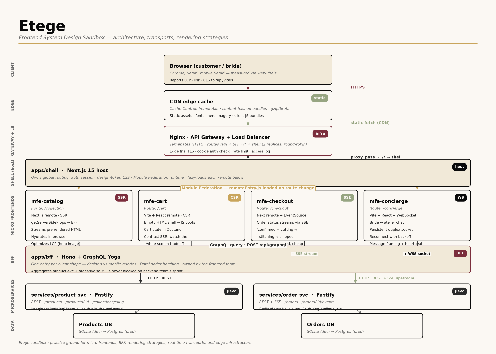
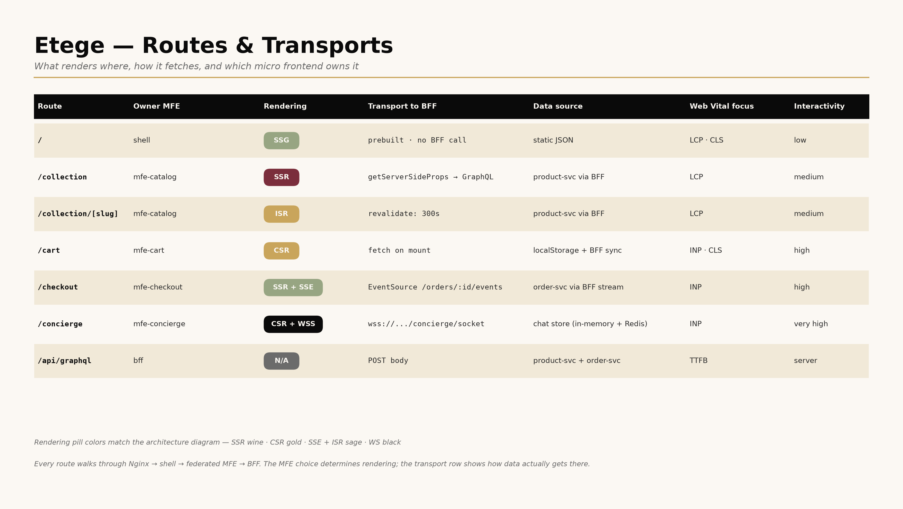

# Atelier

A frontend system design sandbox. The product it builds is **Etege** — a fictional premium Ethiopian heritage fashion house (bridal + ceremonial). The brand is the excuse; the point is to practice the patterns that senior frontend engineers work with in production:

- **Micro frontends** with Module Federation (shell + independent remotes)
- **BFF** (Backend for Frontend) with GraphQL
- **Rendering strategies:** SSR, SSG, ISR, CSR — one micro frontend each
- **Real-time transports:** polling, WebSockets, Server-Sent Events
- **Monorepo tooling** with pnpm workspaces + Turborepo
- **Design tokens + shared UI** as internal packages
- **Docker + Nginx** as API gateway and load balancer
- **Core Web Vitals** instrumented in-app (LCP / INP / CLS)

## Architecture





Regenerate the diagrams with `python docs/render_architecture.py` (requires matplotlib).

## Structure

```
apps/
  shell/            Next.js 15 host, Module Federation container
  mfe-catalog/      Next.js SSR remote — bridal & ceremonial collection
  mfe-cart/         Vite React SPA remote — CSR
  mfe-checkout/     Next.js remote consuming SSE from BFF
  mfe-concierge/    Vite React with WebSocket bidirectional chat
  bff/              Hono BFF with GraphQL
services/
  product-svc/      Fastify REST — the "product microservice"
  order-svc/        Fastify REST + SSE — the "order microservice"
packages/
  tokens/           Design tokens (CSS custom properties + Tailwind preset)
  ui/               Shared accessible components (Button, Input, Card)
infra/
  nginx/            Nginx gateway + load balancer config
  docker-compose.yml
```

## Getting started

```sh
pnpm install
pnpm dev
```

Requires Node ≥ 20.11, pnpm ≥ 11, Docker (for the Nginx + LB step).
